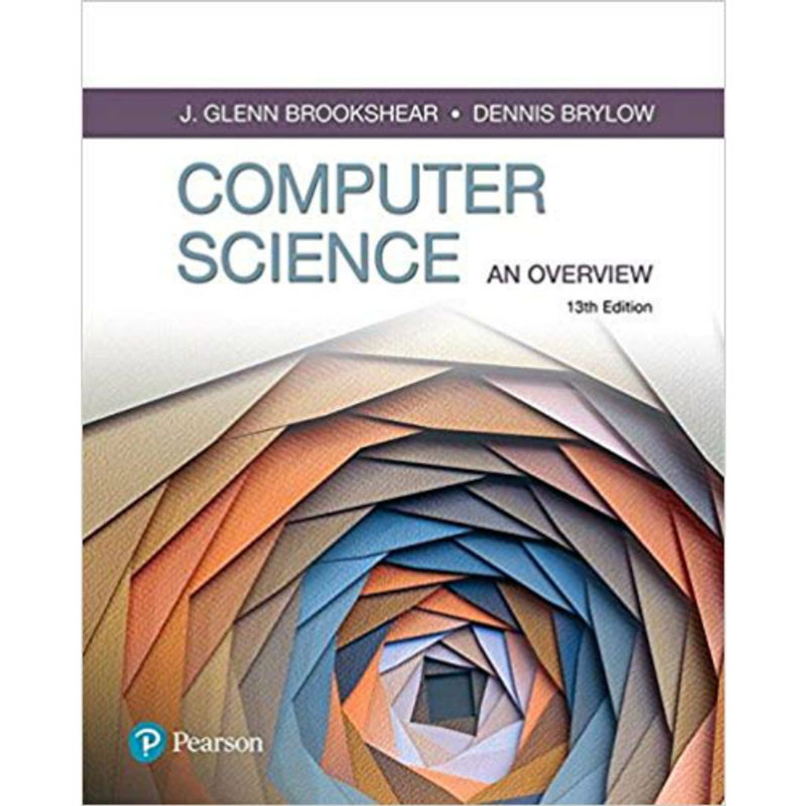

<h6>ver. Aug-2023</h6>
<h3>CIS-101 "Introduction to Computer Science" </h3>
<h5><i> Prof. Sangmork "SAM" Park (Col(R). ROKAF)</i></h5>
<h5><u><i>Department of Computer and Information Sciences, Virginia Military Institute</i></u></h5>

<h5>  FALL, 2023 </h5>

---

<h4>Textbook:</h4> 

<em><u>["Computer Science an Overview 13th Edition", J. Glenn Brookshear and Dennis Brylow.](https://www.pearson.com/en-us/subject-catalog/p/computer-science-an-overview/P200000003351/9780134875460)</u></em>
ISBN 10 : 013487546X

---

<h4>Course description:</h4>
An overview of the field of computer science and the scope of computer science programs. The course provides exposure and foundation to appreciate the relevance and interrelationships of future courses in the CS program and insight of computer algorithms-oriented problem-solving methods in the real world. Topics include history of computer, number systems, computer architecture, operating systems, computer networks, security, algorithms, databases, programming languages, software development life cycle, applications, and ethics and professionalism in computer science.

<h4>Course Objectives:</h4>
<h6> 1. Historical developments, pillars of computer science and techniques to understand ethical/social issues.</h6> 
<h6> 2. Number systems, information encoding and storage, data structures.</h6> 
<h6> 3. High level understanding of computer architecture, operating systems, and networks</h6> 
<h6> 4. Algorithms, efficiency, and abstraction</h6> 
<h6> 5. Introduction to concepts of computer security</h6> 
<h6> 6. Database fundamentals and the relational model</h6> 
<h6> 7. Other fields within Computer Science such as Software Engineering, Artificial intelligence, Human Computer Interaction, Computation Theory, and Graphics.</h6>

<h4>Course Learning Outcomes:</h4>
After this course, the students should be able to
<h6> A. Describe how to convert numbers between different number systems and outline how the binary system can be utilized to express various types of information for data storage and computer operations.</h6> 
<h6> B. List the components of a computer organization and describe the functions of each component.</h6> 
<h6> C. Describe the concept of algorithms and identify algorithms for developing a problem-solving method.</h6> 
<h6> D. Comprehend the fundamental and broad concepts of technologies used in different computer science domains.</h6>

## <h4>Course Schedule: Refer to Course Syllabus</h4>

<h4>References</h4>

1. [SAM's GitHub Reference Page](<https://github.com/silverwing-coder/Miscellaneous/blob/master/(Manual)GitHub.md>)

2. TBN
